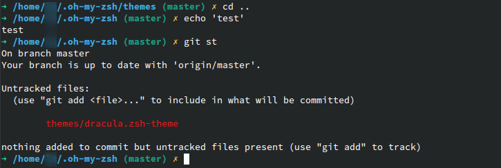

# Dracula for [ZSH](http://zsh.org)

> A dark theme for [ZSH](http://zsh.org).



## Install

All instructions can be found at [draculatheme.com/zsh](https://draculatheme.com/zsh).

## Configuration

### Disabling Git Segment

The git segment can be disabled by setting the following in the config:

```
DRACULA_DISPLAY_GIT=0
```

### Time Segment

The time segment shows a clock in either a 12 or 24 hour format
based on your locale. To enable it, use the following in your config file:

```
DRACULA_DISPLAY_TIME=1
```

If you want to set the time format, you can set this using the
[strftime(3)](https://manpage.me/?q=strftime) format. For example to use a 24
hour format:

```
DRACULA_TIME_FORMAT="%-H:%M"
```

### Context Segment

The context segment shows the username, and, if the user is root or logged in via
SSH, the hostname of the system. To enable this segment, use the following in your config file:

```
DRACULA_DISPLAY_CONTEXT=1
```

### Directory Segment

The current working directory is displayed as base name only.  To display full
path, use the following in your config file:

```
DRACULA_DISPLAY_FULL_CWD=1
```

### Status Segment Indicator

The status segment indicator (the arrow at the beginning), can be changed by setting the `DRACULA_ARROW_ICON` variable. For example, to use an ASCII '->':

```sh
DRACULA_ARROW_ICON="-> "

```

### Custom Segment

The custom segment can be changed by setting the `DRACULA_CUSTOM_VARIABLE` environmental variable.

```sh
export DRACULA_CUSTOM_VARIABLE=AWS:PROD:EU-WEST-1
```

### New Line for commands

You can display a new line for your commands. So you are able to split the terminal infos and the following command in seperate lines.

```sh
DRACULA_DISPLAY_NEW_LINE=1
```

### Git Locking

This program automatically makes use of git's `--no-optional-locks` option,
and it should automatically detect if your version supports the option. However,
if, for some reason, the automatically detected values are incorrect, you can
forcefully disable or enable the functionality by setting the variable
`DRACULA_GIT_NOLOCK` to 0 or 1, respectively.

## Team

This theme is maintained by the following person(s) and a bunch of [awesome contributors](https://github.com/dracula/zsh/graphs/contributors).

| [](https://github.com/avalonwilliams) |
| --------------------------------------------------------------------------------------------------------------- |
| [Avalon Williams](https://github.com/avalonwilliams)                                                            |

## Community

- [Twitter](https://twitter.com/draculatheme) - Best for getting updates about themes and new stuff.
- [GitHub](https://github.com/dracula/dracula-theme/discussions) - Best for asking questions and discussing issues.
- [Discord](https://draculatheme.com/discord-invite) - Best for hanging out with the community.

## License

[MIT License](./LICENSE)
