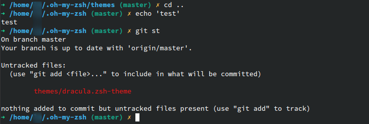

# Dracula for [Zsh](https://zsh.org)

> A dark theme for [Zsh](https://zsh.org).

## Installation

All instructions can be found at [draculatheme.com/zsh](https://draculatheme.com/zsh).

## Team

This theme is maintained by the following person and many [amazing contributors](https://github.com/dracula/zsh/graphs/contributors).

|  |
| ------------------------------------------------------------------------------------------------- |
| [Luxonauta](https://github.com/luxonauta)                                                         |

## Community

- [Twitter](https://twitter.com/draculatheme) - Updates about themes and releases.
- [GitHub](https://github.com/dracula/dracula-theme/discussions) - Questions, ideas, and discussions.
- [Discord](https://draculatheme.com/discord-invite) - Chat with the Dracula community.

## Dracula PRO

## License

[MIT License](./LICENSE)
